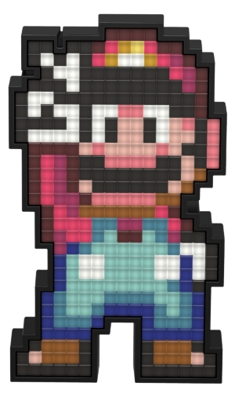

  

[+ao+meu+GitHub!:%29)](https://git.io/typing-svg) 

 
 
 
 
 
 

- ⌨ Este é o meu Portfólio e minha história como Desenvolvedor
- 📑 Realizo diversos projetos pessoais e como freelancer
- 💻 Aficionado pelo mundo da tecnologia
- 🎮 Gamer nas horas vagas
- ⚽ Jogador de Futebol de fim de semana, rs

 
 
 

  

    <a href="https://github.com/jonathanmeninezt">
  
  

 
 
 

  

 
  
  
  
  
  

##
 
 
 
 
 

 
 
  
  
  
   
 
  
 

  
  

